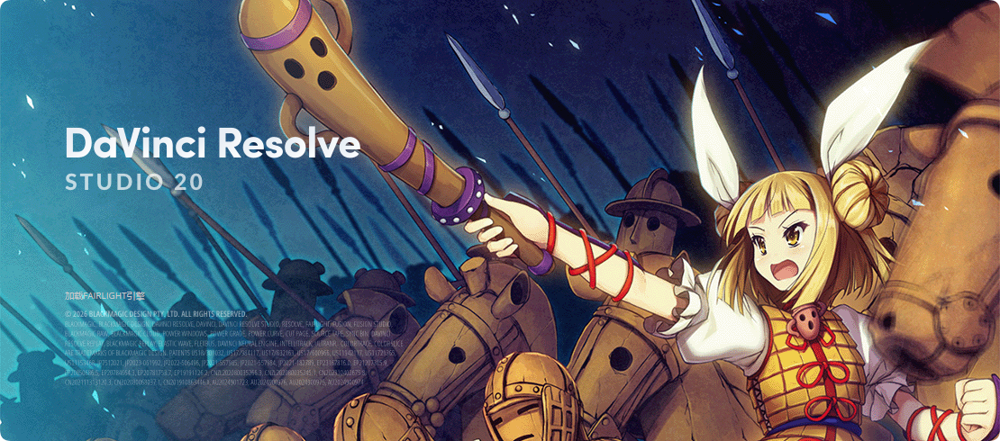
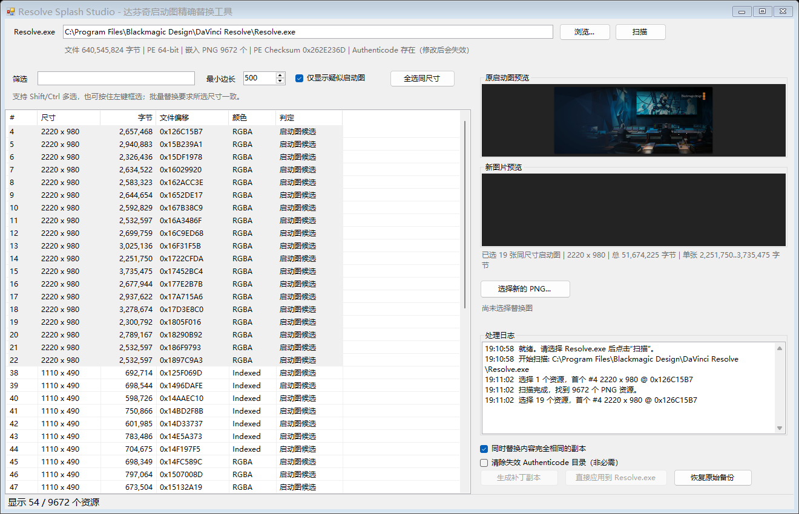

# DaVinci Resolve Splash 达芬奇启动界面替换器 使用说明

Resolve Splash Studio 是一个 Windows 原生 GUI 工具，用于从 DaVinci Resolve 的 `Resolve.exe` 中定位内嵌 PNG 启动图。⚠本项目使用了人工智能构建

## 一、功能

- 自动定位 `C:\Program Files\Blackmagic Design\DaVinci Resolve\Resolve.exe`
- 扫描 EXE 内所有有效 PNG 资源，不依赖固定偏移或固定版本
- 支持按尺寸、偏移、颜色类型、字节数过滤
- 默认筛选疑似启动图：宽高比约 2.15 到 2.42，例如：
  - `2220 x 980`
  - `1110 x 490`
  - `1070 x 450`
- 支持 Shift/Ctrl 多选、鼠标拖拽框选、全选同尺寸
- 同尺寸启动图可一次批量替换，自动分别适配每个资源的原始长度
- 原图和新图双预览
- 强制要求新 PNG 与原 PNG 宽高完全一致
- 自动用合法 PNG 辅助 chunk 和 zlib 重压缩把新图补到原图字节数
- 重新计算所有 PNG chunk 的 CRC
- 重新计算并复核 PE Header Checksum
- 可选清除已经失效的 Authenticode 安全目录
- 生成 JSON 清单和 SHA-256
- 支持直接应用、自动备份和一键恢复

## 二、运行要求

- Windows 10 / 11
- .NET Framework 4.8（Windows 10/11 通常已内置）
- 不需要 Python，不需要 Photoshop 插件

## 三、推荐操作流程

1. 完全退出 DaVinci Resolve。
2. 运行 `ResolveSplashStudio.exe`。
3. 确认 `Resolve.exe` 路径，点击“扫描”。
4. 保持勾选“仅显示疑似启动图”。
5. 选择要替换的资源，例如 `2220 x 980`。
   - 按住 `Shift` 或 `Ctrl` 点击可多选。
   - 在列表中按住鼠标左键拖拽可框选。
   - 也可以选中任意一张后点击“全选同尺寸”。
6. 点击“选择新的 PNG...”。
   - 批量替换时，所有所选原图必须尺寸完全一致。
   - 工具会按每个资源的原始字节长度分别进行精确适配。
   - 新图必须正好是同一个宽高。
   - 如果提示无法精确适配，请重新导出 PNG，减少元数据或改用不同的压缩设置。
7. 先点击“生成补丁副本”做安全测试。
   - 输出文件例如 `Resolve.patched.exe`
   - 同目录会生成 `.manifest.json`
8. 确认无误后，再点击“直接应用到 Resolve.exe”。
   - 首次应用前会创建 `Resolve.exe.original.bak`
   - 写入 Program Files 通常需要右键管理员身份运行本工具

如果启动画面没有变化，可能是 Resolve 根据 DPI 使用了另一档尺寸。可以再选择相同的 `1110 x 490` 或 `1070 x 450` 资源重复替换。选择“同时替换内容完全相同的副本”可一次处理字节内容完全一致的重复资源。

## 四、校验和与签名说明

工具会做到：

- 修改前后 `Resolve.exe` 文件总长度一致
- 不改变其他资源的绝对偏移
- 替换后的 PNG 能被重新解析
- 所有 PNG chunk CRC 正确
- PE Header Checksum 用 Windows `imagehlp.dll` 重新计算并复核
- 生成原文件与输出文件的 SHA-256 清单

必须说明的限制：

- 原始 DaVinci Resolve 由 Blackmagic 使用私钥进行 Authenticode 签名。
- 修改 EXE 内容后，任何人都无法在不持有 Blackmagic 私钥的情况下重新生成相同的厂商签名。
- 默认保留证书区时，Windows 会把输出标记为 `HashMismatch`。
- 勾选“清除失效 Authenticode 目录”后，Windows 会显示为 `NotSigned`。
- 两种方式都不会影响 PE 文件可以正常启动，但都不是“伪造原厂商签名”。
- 工具不会修改许可证、激活状态或 Studio 功能，只替换匹配的 PNG 字节。

## 五、恢复原版

- 点击“恢复原始备份”，或
- 关闭 Resolve 后，将：
  `Resolve.exe.original.bak`
  复制回：
  `Resolve.exe`

## 六、源码

源码压缩包包含：

- `Core.cs`：PE 解析、PNG 扫描/重建、CRC、PE Checksum、补丁和清单
- `Gui.cs`：WinForms GUI
- `Tests.cs`、`PatchTests.cs`：核心和真实 640 MB 文件补丁验证
- `UiSmoke.cs`、`BatchUiSmoke.cs`：GUI 扫描、框选、19 张同尺寸批量替换烟测
- `BatchPatchTest.cs`：真实 640 MB 文件一次写入 19 个资源的验证
- `build.ps1`：使用 Windows 内置 C# 编译器重建

参考方法：
[Custom DaVinci Resolve splash screen](https://www.reddit.com/r/davinciresolve/comments/1k2jy2d/custom_davinci_resolve_splash_screen/)
